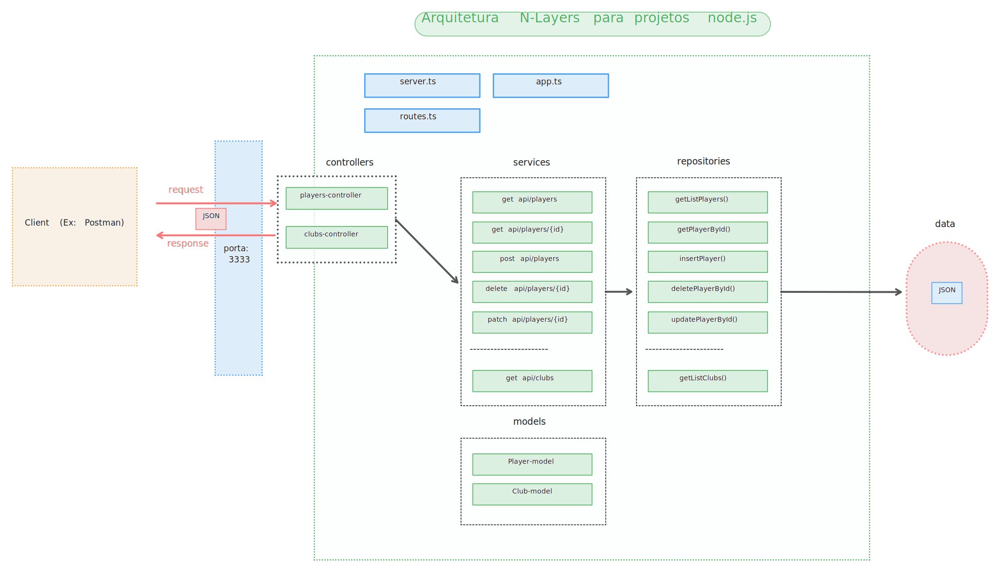

# Node TS Express REST API - Champions League

## Descrição

Este projeto é uma API REST construída com Node.js, TypeScript e Express, projetada para servir de base para um game sobre futebol baseado na Champions League. A arquitetura segue o padrão N-Layers, garantindo organização e escalabilidade.

## Tecnologias Utilizadas

- **Node.js** - Plataforma de execução para o JavaScript no servidor.
- **TypeScript** - Superconjunto do JavaScript que adiciona tipagem estática.
- **Express** - Framework web minimalista e flexível para Node.js.

## Funcionalidades

- **Jogadores**:
  - Listar todos os jogadores.
  - Listar jogador específico por ID.
  - Adicionar novos jogadores.
  - Atualizar informações de jogadores pelo ID.
  - Remover jogadores por ID.
- **Clubes**:
  - Listar todos os clubes.

## Arquitetura

O projeto segue o padrão N-Layers, dividido em **controllers**, **services**, **repositories**, e **models**. Abaixo está o diagrama representando a arquitetura:



### Estrutura do Projeto

```plaintext
src
├── controllers
│   ├── clubs-controller.ts
│   └── players-controller.ts
├── data
│   ├── clubs.json
│   └── players.json
├── models
│   ├── club-model.ts
│   ├── http-response-model.ts
│   ├── player-model.ts
│   └── statistics-model.ts
├── repositories
│   ├── clubs-repository.ts
│   └── players-repository.ts
├── services
│   ├── clubs-services.ts
│   └── player-services.ts
├── utils
│   ├── http-helper.ts
│   └── status-code.ts
├── app.ts
├── routes.ts
└── server.ts
```

## Rotas Disponíveis

### Jogadores

- **GET** `/players`: Lista todos os jogadores.
- **GET** `/players/:id`: Retorna um jogador específico por ID.
- **POST** `/players`: Adiciona um novo jogador.
- **DELETE** `/players/:id`: Remove um jogador pelo ID.
- **PATCH** `/players/:id`: Atualiza um jogador pelo ID.

### Clubes

- **GET** `/clubs`: Lista todos os clubes.

## Licença

Este projeto é licenciado sob a Licença MIT. Veja o arquivo [LICENSE](./LICENSE) para mais informações.